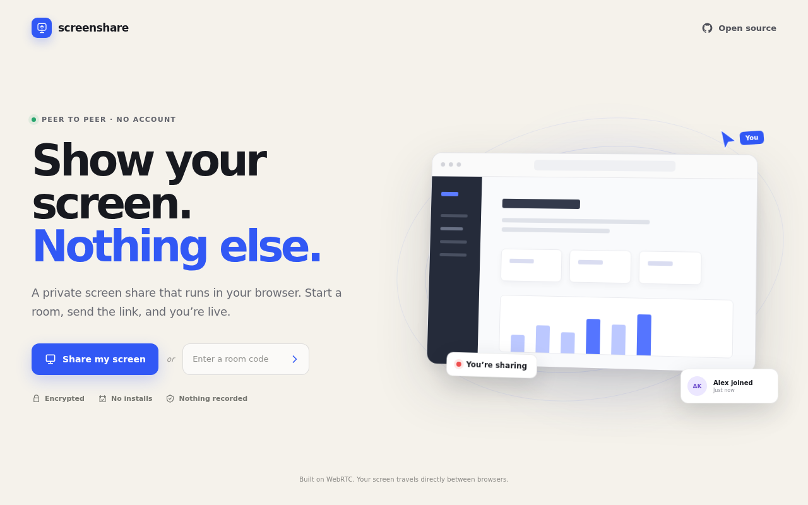

# screenshare

A deliberately small, open-source screen sharing service. Create a room, send a link, and let any participant take a turn sharing—no accounts, downloads, or room history.

[](https://miseshare.vercel.app)

Live demo: [miseshare.vercel.app](https://miseshare.vercel.app)

WebRTC carries video directly between browsers. An embedded, self-hosted PeerServer only brokers the initial connections.

## Run it locally

```bash
npm install
npm run dev
```

Open [http://localhost:3000](http://localhost:3000). Screen capture works on `localhost`; a deployed instance must use HTTPS.

## Deploy to Vercel

The repository exports its Node HTTP server for Vercel and keeps the local `npm start` entrypoint. With the authenticated Vercel CLI:

```bash
npx vercel@latest --prod
```

Vercel serves files in `public/` from its CDN and runs the embedded PeerServer as a Node Function. WebSocket support on Vercel is currently Public Beta. Existing sockets stay on one Function instance, but a later connection is not guaranteed to reach that same instance. This in-memory PeerServer layout is suitable for a small deployment; reliable horizontal scaling requires an external signaling service or shared cross-instance signaling layer.

## Configuration

| Variable | Default | Purpose |
| --- | --- | --- |
| `PORT` | `3000` | HTTP port |
| `HOST` | `0.0.0.0` | HTTP bind address |
| `BASE_PATH` | _(empty)_ | Optional URL prefix, such as `/previews/screenshare` |
| `MAX_VIEWERS` | `5` | Maximum viewers per room |
| `STUN_URLS` | `stun:main.lohr.dev:3478` | Comma-separated STUN URLs; non-STUN entries are ignored |

The app is intentionally STUN-only and does not configure a TURN relay. Connections that cannot establish a direct ICE path will fail instead of relaying media through a third party. A normal reverse proxy can terminate TLS and forward HTTP and WebSocket traffic to this app, but it does not relay WebRTC media.

## How it works

- A room code is the creator's temporary PeerJS ID. The room remains open when screen sharing stops and closes only when the creator leaves or presses **Close room**.
- One participant presents at a time. That presenter creates a direct WebRTC connection to every other room participant.
- Viewers can start sharing whenever the room has no active presenter; stopping returns everyone to the persistent room and leaves chat connected.
- A small room chat uses the same peer-to-peer connections and keeps only the latest 50 messages in the host's browser memory.
- Hosts can optimize a live stream for text clarity or smooth motion, use balanced/data-saver presets, or set resolution, frame rate, bitrate, and content hints individually.
- The quality panel estimates host upload for the current viewer count and a full room. This is an approximate ceiling; WebRTC compression and congestion control can send less.
- Self-hosted [PeerJS](https://peerjs.com/) handles signaling and connection negotiation. PeerServer never receives screen media.
- There is no recording, analytics, database, or authentication.

The one-to-many peer layout is ideal for a small, simple tool. For large audiences, use an SFU instead of adding more host peer connections.

## License

MIT
